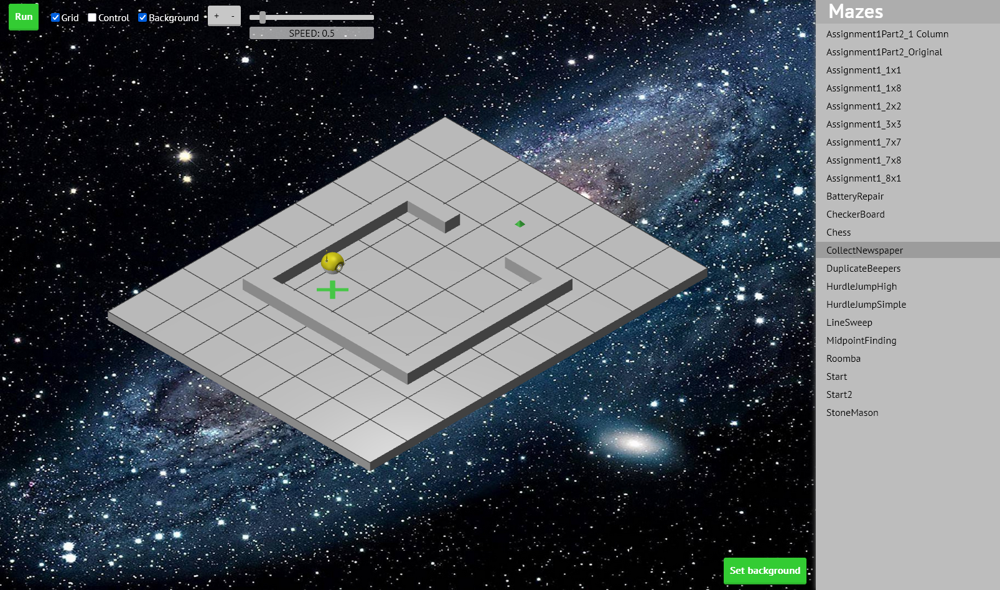
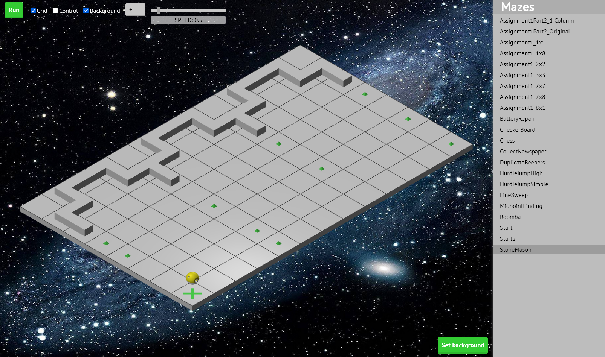
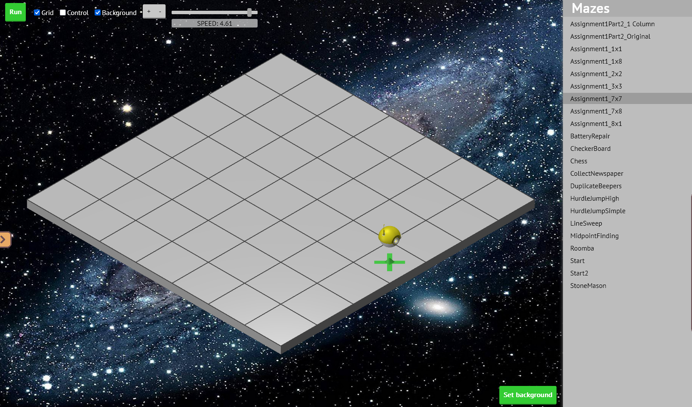

# shPlusPlus_Assignment1

This code is for the Java Course from Ш++.

>Note:
- I'm not sure if I have the right to share the original task description, so here is a brief summary of the tasks.
- All the tasks were based on Karel. The use of local variables, do...while loops, and methods with anything other than return void was not allowed.

## Assignment1Part1 - Newspaper
Task: Karel needs to walk over, pick up the newspaper (beeper), and come back.  
Map: CollectNewspaper

## Assignment1Part2 - Rows of pebbles
Task: Karel must build walls using “stones” (beepers) from left to right. The columns are spaced 3 squares apart.
Map: StoneMason

## Assignment1Part3 - Find the middle
Task: Karel must find the center of the southern strip. If the width of the grid is even, place the beeper in one of the two central cells.
Map: Not provided, but it has been tested on all edge cases (1x1, 1x8, 8x1, 7x7, 8x8)

## Assignment1Part4 - Chessboard
Task: Karel must create a “chessboard” using beepers in a rectangular empty world.
Map: Not provided, but it has been tested on all edge cases (1x1, 1x8, 8x1, 7x7, 8x8)

